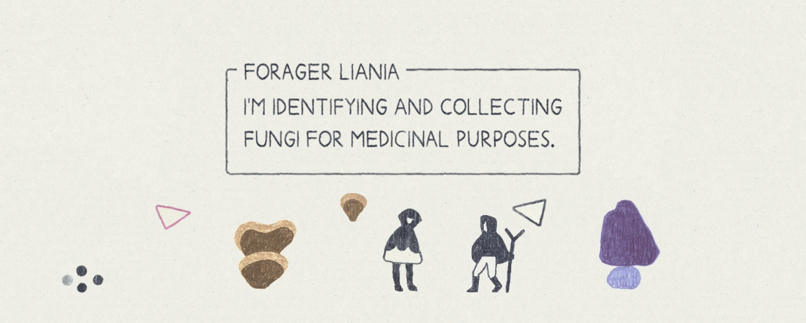
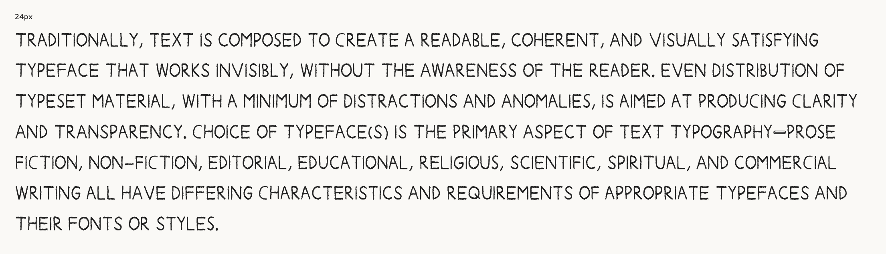
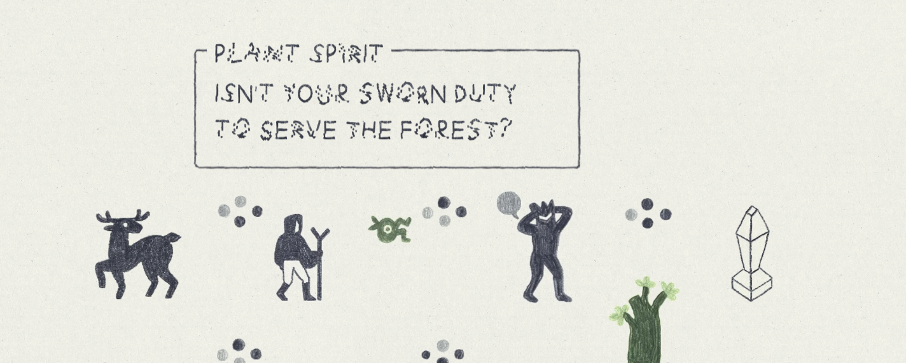
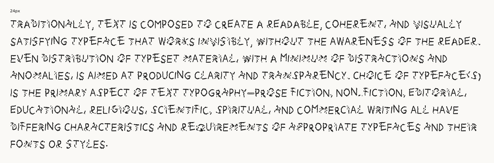
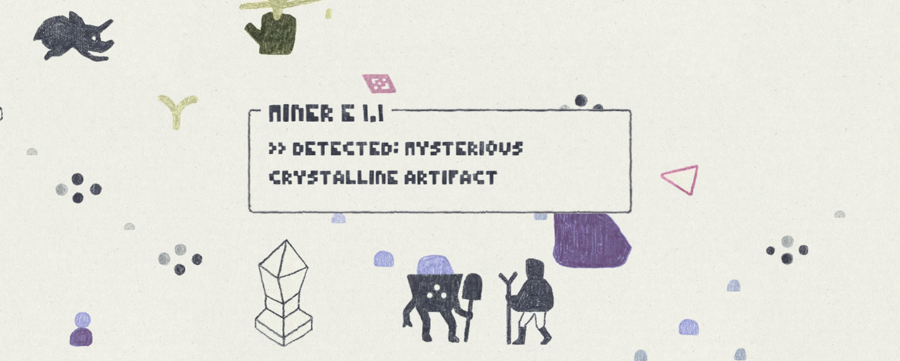
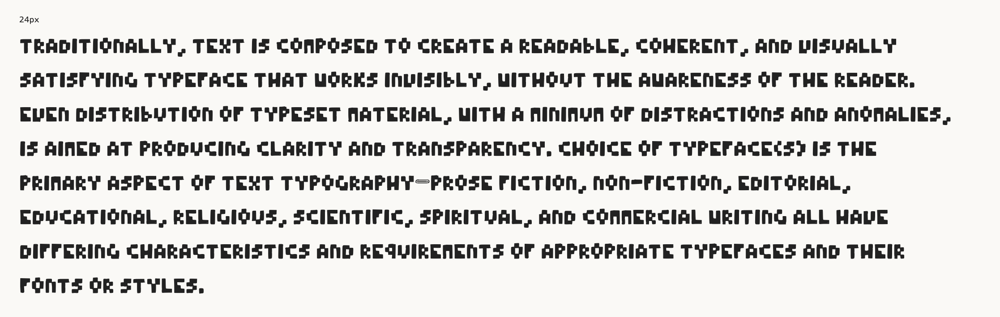
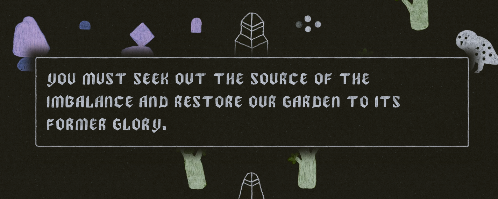
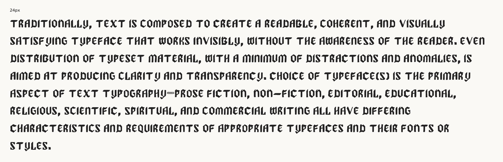

# wilderplace-fonts

A collection of CC0 licensed fonts used [in the upcoming game Wilderplace](https://store.steampowered.com/app/1769640/Wilderplace/). All characters were hand-drawn and then vectorized and converted into font files using [calligraphr](https://www.calligraphr.com/).

These fonts:
- Are capital-letters only.
- Character sets includes A-Z, 0-9, and basic punctuation.
- Contain at least one variant per character to sell the hand-drawn look.
- Use auto-generated tracking from [calligraphr](https://www.calligraphr.com/), which is not very good. You'll have to embrace the raw aesthetic or find another source for your fonts!

## Previews
### Wilderplace Sans Regular




### Wilderplace Glitch Regular




### Wilderplace Pixel Regular




### Wilderplace Divine Regular




### CSS Usage

Assuming you've downloaded the fonts and have the following file structure:

```
/style.css
/WilderplaceSans-Regular.otf
/WilderplaceGlitch-Regular.otf
/WilderplacePixel-Regular.otf
/WilderplaceDivine-Regular.otf
```

```css
/* style.css */
@font-face {
  font-family: 'Wilderplace Sans';
  src: url('./WilderplaceSans-Regular.otf') format('opentype');
}

@font-face {
  font-family: 'Wilderplace Glitch';
  src: url('./WilderplaceGlitch-Regular.otf') format('opentype');
}

@font-face {
  font-family: 'Wilderplace Pixel';
  src: url('./WilderplacePixel-Regular.otf') format('opentype');
}

@font-face {
  font-family: 'Wilderplace Divine';
  src: url('./WilderplaceDivine-Regular.otf') format('opentype');
}

.font-wilderplace-sans {
  font-family: 'Wilderplace Sans';
}

.font-wilderplace-glitch {
  font-family: 'Wilderplace Glitch';
}

.font-wilderplace-glitch {
  font-family: 'Wilderplace Glitch';
}

.font-wilderplace-pixel {
  font-family: 'Wilderplace Pixel';
}

.font-wilderplace-divine {
  font-family: 'Wilderplace Divine';
}
```

For a more authentic hand-drawn look, consider [CSS background clip](https://developer.mozilla.org/en-US/docs/Web/CSS/background-clip) to add a texture behind the fonts.